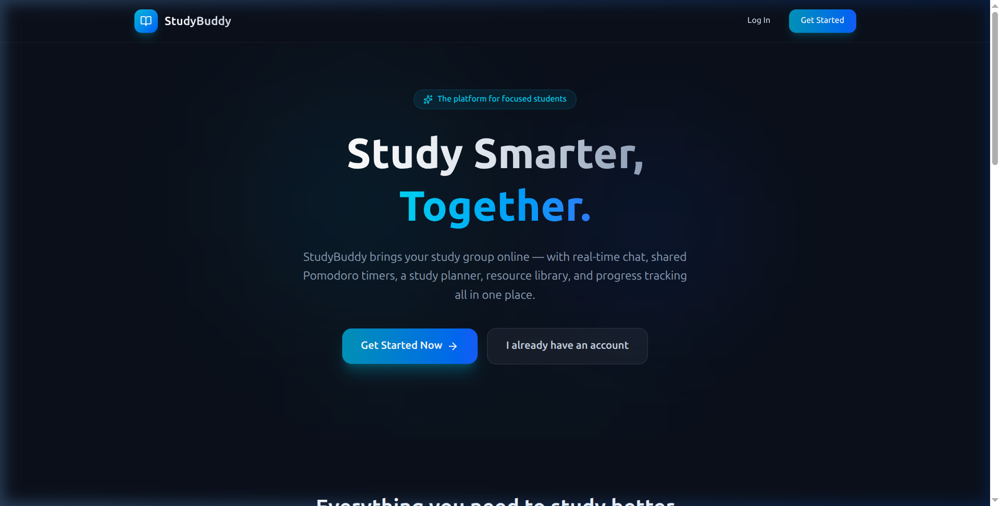
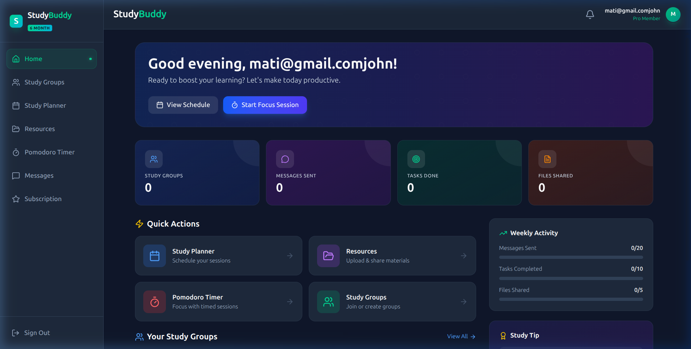
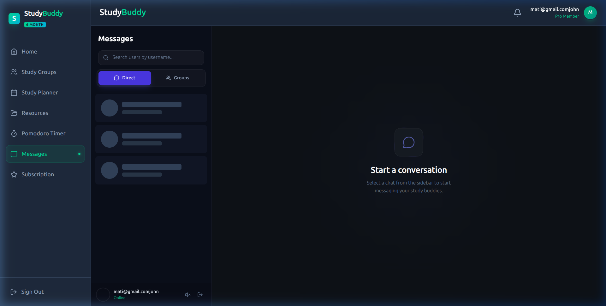
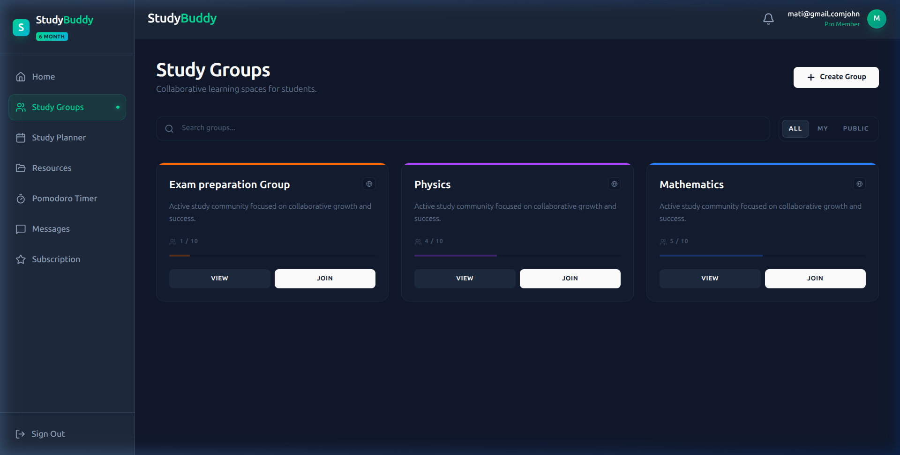
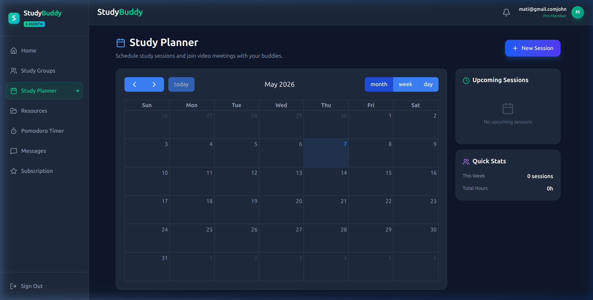
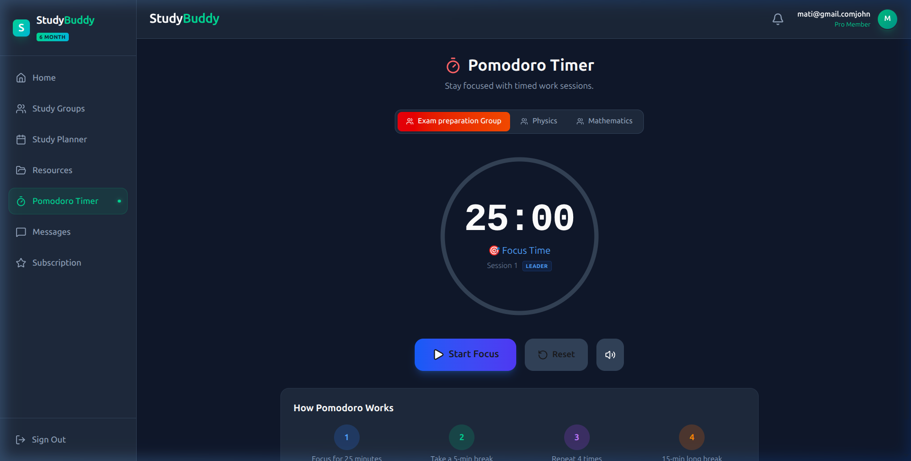
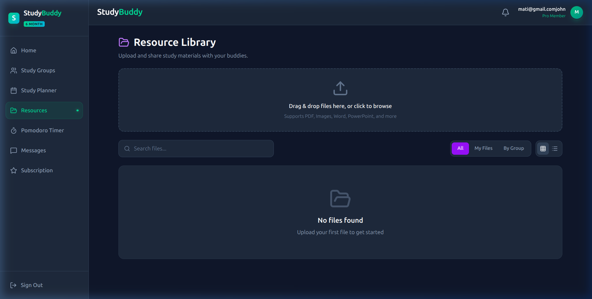
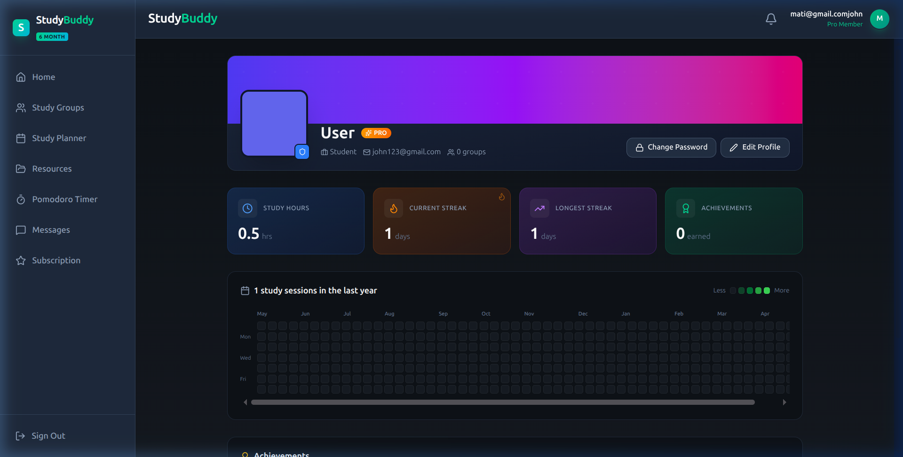
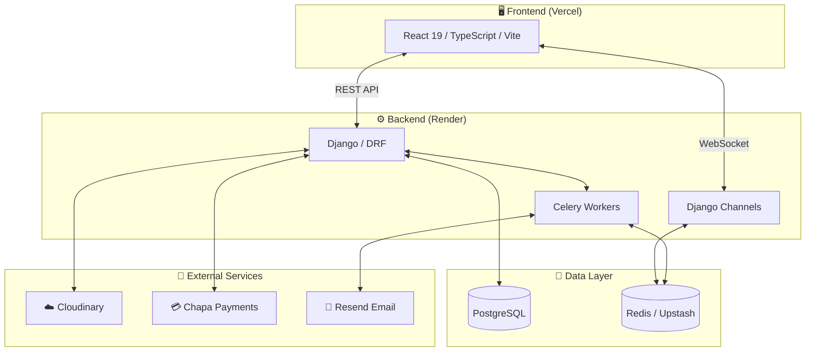

<](https://study-buddy-pied-five.vercel.app)
[](https://github.com/ashenafi-16/StudyBuddy/stargazers)
[](https://github.com/ashenafi-16/StudyBuddy/network/members)
[](https://github.com/ashenafi-16/StudyBuddy/issues)
[](LICENSE)

<br/>



</div>

---

## 🎬 Platform Demo

> **Landing → Login → Dashboard → Groups → Chat → Planner → Pomodoro → Resources → Profile** — a quick tour of the entire platform.

<div align="center">

</div>

---

### ⚡ Quick Setup

```bash
# 1. Clone & install
git clone https://github.com/ashenafi-16/StudyBuddy.git && cd StudyBuddy

# 2. Backend
cd backend
python -m venv venv && source venv/bin/activate
pip install -r requirements.txt
cp .env.example .env          # configure your keys (see Getting Started below)
python manage.py migrate
python manage.py seed_plans
python manage.py runserver    # → http://localhost:8000

# 3. Frontend
cd ../frontend
npm install
cp .env.example .env          # set VITE_API_URL & VITE_WS_URL
npm run dev                   # → http://localhost:5173
```

| Variable | Description |
|:---|:---|
| `DJANGO_SECRET_KEY` | Django secret key |
| `DATABASE_URL` | PostgreSQL or `sqlite:///db.sqlite3` for dev |
| `CLOUDINARY_*` | Cloud name, API key & secret |
| `CHAPA_SECRET_KEY` | Chapa payment gateway key |
| `REDIS_URL` | Redis URL for WebSockets & Celery |
| `VITE_API_URL` | Backend API URL (e.g. `http://127.0.0.1:8000`) |
| `VITE_WS_URL` | WebSocket URL (e.g. `ws://127.0.0.1:8000`) |

---

## ✨ Feature Showcase

### 🏠 Dashboard
Personalized greeting, study stats, quick actions, group overview, weekly activity progress, and study tips — all at a glance.



---

### 💬 Real-Time Messaging
WebSocket-powered instant messaging with user search, online presence indicators, typing detection, media sharing, and conversation starters.



---

### 👥 Study Groups
Create, discover, and join study groups. Color-coded cards with member counts, search/filter, and group-level permissions.



---

### 📅 Study Planner
FullCalendar-powered scheduler with month/week/day views, upcoming sessions panel, and quick stats for session tracking.



---

### ⏱️ Pomodoro Timer
Group-synced focus timer with 25/5/15 intervals, session tracking, audio alerts, and step-by-step workflow guide.



---

### 📂 Resource Library
Centralized hub for uploading, organizing, and sharing study materials across your groups.



---

### 👤 User Profile
GitHub-style activity heatmap, study streak tracking, achievement system, and editable profile with Pro badge.



---

## 🛠️ Tech Stack

<table>
<tr>
<td valign="top" width="50%">

### Backend
| Technology | Purpose |
|:---|:---|
| **Django 5.2** | Web framework |
| **Django REST Framework** | RESTful API layer |
| **Django Channels** | WebSocket real-time communication |
| **PostgreSQL** | Production database |
| **Redis** | Channel layer & Celery broker |
| **SimpleJWT** | Token-based authentication |
| **Cloudinary** | Media storage & CDN |
| **Chapa** | Payment gateway (ETB) |
| **Celery** | Async task processing |
| **Resend** | Transactional email |

</td>
<td valign="top" width="50%">

### Frontend
| Technology | Purpose |
|:---|:---|
| **React 19** | UI framework |
| **TypeScript** | Type safety |
| **Vite 7** | Build tool & dev server |
| **Tailwind CSS v4** | Utility-first styling |
| **Zustand** | Global state management |
| **React Context** | Auth & theme state |
| **React Router v7** | Client-side routing |
| **Lucide React** | Icon system |
| **FullCalendar** | Calendar widget |
| **React Hot Toast** | Notification toasts |

</td>
</tr>
</table>

---

## 🏗️ System Architecture



---

## 🚀 Getting Started

### Prerequisites

| Requirement | Version |
|:---|:---|
| Python | 3.10+ |
| Node.js | 18+ |
| Redis | 6+ |
| PostgreSQL | 14+ *(or SQLite for dev)* |

### 1. Clone the Repository

```bash
git clone https://github.com/ashenafi-16/StudyBuddy.git
cd StudyBuddy
```

### 2. Backend Setup

```bash
cd backend
python -m venv venv
source venv/bin/activate      # Windows: venv\Scripts\activate
pip install -r requirements.txt
```

Create a `.env` file in `backend/`:

```env
DEBUG=True
DJANGO_SECRET_KEY=your-secret-key

# Database (use SQLite for dev, PostgreSQL for prod)
DATABASE_URL=sqlite:///db.sqlite3

# Cloudinary
CLOUDINARY_CLOUD_NAME=your-cloud-name
CLOUDINARY_API_KEY=your-api-key
CLOUDINARY_API_SECRET=your-api-secret

# Chapa Payment
CHAPA_SECRET_KEY=your-chapa-secret
CHAPA_MOCK_MODE=True

# Redis (for WebSockets & Celery)
REDIS_URL=redis://localhost:6379

# Email
EMAIL_HOST_USER=your-email@gmail.com
EMAIL_HOST_PASSWORD=your-app-password

# Frontend URL (CORS)
FRONTEND_URL=http://localhost:5173
CORS_ALLOWED_ORIGINS=http://localhost:5173
```

Run migrations and start the server:

```bash
python manage.py migrate
python manage.py seed_plans       # Seed subscription plans
python manage.py runserver
```

### 3. Frontend Setup

```bash
cd frontend
npm install
```

Create a `.env` file in `frontend/`:

```env
VITE_API_URL=http://127.0.0.1:8000
VITE_WS_URL=ws://127.0.0.1:8000
```

Start the dev server:

```bash
npm run dev
```

The app will be running at **http://localhost:5173**.

---

## 🔌 API Reference

<details>
<summary><b>Authentication</b></summary>

| Method | Endpoint | Description |
|:---|:---|:---|
| `POST` | `/api/auth/register/` | Register new user |
| `POST` | `/api/auth/login/` | Login (returns JWT) |
| `POST` | `/api/auth/token/refresh/` | Refresh access token |
| `GET` | `/api/auth/profile/` | Get user profile |
| `GET` | `/api/auth/users/search/?q=` | Search users |

</details>

<details>
<summary><b>Subscriptions</b></summary>

| Method | Endpoint | Description |
|:---|:---|:---|
| `GET` | `/api/subscriptions/plans/` | List subscription plans |
| `POST` | `/api/subscriptions/subscribe/` | Initiate subscription |
| `GET` | `/api/subscriptions/verify/` | Verify Chapa payment |

</details>

<details>
<summary><b>Groups</b></summary>

| Method | Endpoint | Description |
|:---|:---|:---|
| `GET` | `/api/group/groups/` | List all groups |
| `POST` | `/api/group/groups/` | Create a group |
| `GET` | `/api/group/groups/:id/` | Group detail |
| `POST` | `/api/group/groups/:id/join/` | Join a group |
| `GET` | `/api/groups/search/?q=` | Search groups |

</details>

<details>
<summary><b>Messaging</b></summary>

| Method | Endpoint | Description |
|:---|:---|:---|
| `GET` | `/api/messages/conversations/` | List conversations |
| `POST` | `/api/messages/conversations/start_individual/` | Start DM |
| `GET` | `/api/messages/conversations/:id/messages/` | Get messages |
| `WS` | `/ws/chat/:conversation_id/` | WebSocket chat |

</details>

<details>
<summary><b>Planner & Tasks</b></summary>

| Method | Endpoint | Description |
|:---|:---|:---|
| `GET` | `/api/planner/sessions/` | List study sessions |
| `POST` | `/api/planner/sessions/` | Create session |
| `GET` | `/api/Tasks/tasks/` | List tasks |
| `POST` | `/api/Tasks/tasks/` | Create task |

</details>

---

## 🐳 Docker Deployment

```bash
# Build and run all services
docker-compose up --build

# Services:
#   - Backend:  http://localhost:8000
#   - Frontend: http://localhost:3000
#   - Redis:    localhost:6379
```

---

## ☁️ Production Deployment

| Service | Platform | URL |
|:---|:---|:---|
| **Frontend** | Vercel | [study-buddy-pied-five.vercel.app](https://study-buddy-pied-five.vercel.app) |
| **Backend** | Render | [studybuddy-backend-aen2.onrender.com](https://studybuddy-backend-aen2.onrender.com) |
| **Database** | Render PostgreSQL | Managed |
| **Redis** | Upstash | Managed |
| **Media** | Cloudinary | CDN |

---

## 📁 Project Structure

```
StudyBuddy/
├── backend/
│   ├── accounts/          # User auth, profiles, JWT
│   ├── subscriptions/     # Plans, Chapa payment, verification
│   ├── Message/           # Conversations, messages, WebSocket consumers
│   ├── group/             # Study groups, membership, invitations
│   ├── planner/           # Study sessions, calendar integration
│   ├── Tasks/             # Task management
│   ├── resources/         # File sharing & resource library
│   ├── pomodoro/          # Timer state & group sync
│   ├── Notifications/     # Real-time notification system
│   ├── studybuddy/        # Django project settings
│   └── studytracker/      # Analytics & tracking utilities
├── frontend/
│   ├── src/
│   │   ├── pages/         # Route-level page components
│   │   ├── components/    # Reusable UI components
│   │   ├── contexts/      # Auth & Pomodoro context providers
│   │   ├── store/         # Zustand state stores
│   │   ├── api/           # API client & endpoint functions
│   │   ├── services/      # Axios instance & interceptors
│   │   └── types/         # TypeScript type definitions
│   └── public/            # Static assets & screenshots
├── k8s/                   # Kubernetes manifests
├── nginx/                 # Reverse proxy configuration
├── docker-compose.yml     # Multi-container orchestration
└── render.yaml            # Render deployment blueprint
```

---

## 🤝 Contributing

Contributions are welcome! Here's how to get started:

1. **Fork** the repository
2. **Create** a feature branch: `git checkout -b feature/amazing-feature`
3. **Commit** your changes: `git commit -m 'feat: add amazing feature'`
4. **Push** to the branch: `git push origin feature/amazing-feature`
5. **Open** a Pull Request

---

<div align="center">

### Built with ❤️ by [Ashenafi Mulugeta](https://github.com/ashenafi-16)

</div>
]]>
