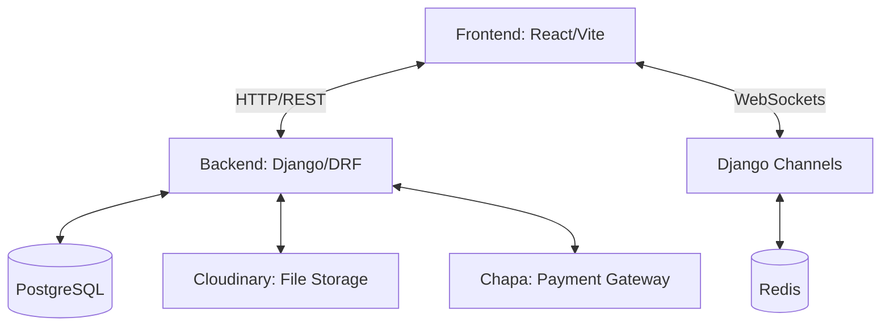

# 📚 StudyBuddy

### *Empowering Collaborative Academic Productivity*

StudyBuddy is a modern, real-time collaboration platform designed specifically for students. It combines the power of real-time communication with essential academic tools like study groups, task management, and focus timers, all wrapped in a sleek, glassmorphic interface.

---

[](https://github.com/ashenafi-16/StudyBuddy/stargazers)
[](https://github.com/ashenafi-16/StudyBuddy/network/members)
[](https://github.com/ashenafi-16/StudyBuddy/issues)
[](LICENSE)

---

## 🚀 Vision

StudyBuddy aims to bridge the gap between solo studying and collaborative learning. Our platform provides a centralized hub where students can connect, share resources, and stay focused using industry-standard productivity techniques like the Pomodoro method.

## ✨ Key Features

### 💬 Real-Time Collaboration
- **Direct & Group Messaging**: Lightning-fast communication powered by WebSockets.
- **Rich Media Sharing**: Drag-and-drop file and image uploads.
- **Interactive Chat**: Reply to messages, typing indicators, and online presence tracking.

### 👥 Study Groups
- **Simplified Management**: Create, manage, and join groups with ease.
- **Invitation System**: Token-based secure invitation links.
- **Group Analytics**: Track group productivity and engagement (Beta).

### 📅 Academic Planning
- **Smart Planner**: FullCalendar integration for scheduling study sessions.
- **Task Management**: Organize tasks with deadlines and progress tracking.
- **Resource Library**: A dedicated space for sharing study materials within groups.

### ⏱️ Focus Tools
- **Shared Pomodoro Timer**: Sync focus sessions with your study group.
- **Persistent State**: Your timer stays active even when you navigate through the app.

### 💳 Premium Features
- **Subscription Gating**: Modern payment integration with Chapa.
- **Dashboard Analytics**: Advanced insights into your study habits.

---

## 🛠️ Tech Stack

### Backend
- **Framework**: [Django 5.2.7](https://www.djangoproject.com/)
- **API**: [Django REST Framework](https://www.django-rest-framework.org/)
- **Real-time**: [Django Channels](https://channels.readthedocs.io/) (WebSockets)
- **Database**: PostgreSQL (Production) / SQLite (Development)
- **Auth**: [SimpleJWT](https://django-rest-framework-simplejwt.readthedocs.io/)
- **Storage**: [Cloudinary](https://cloudinary.com/)

### Frontend
- **Framework**: [React 19](https://reactjs.org/) + [TypeScript](https://www.typescriptlang.org/)
- **Build Tool**: [Vite 7](https://vitejs.dev/)
- **Styling**: [Tailwind CSS v4](https://tailwindcss.com/) + [DaisyUI v5](https://daisyui.com/)
- **State Management**: [Zustand](https://github.com/pmndrs/zustand) & [React Context API](https://react.dev/learn/passing-data-deeply-with-context)
- **Icons**: [Lucide React](https://lucide.dev/)

---

## 🏗️ Architecture



---

## 📸 Screenshots

| Login Page | Sign Up |
| :---: | :---: |
|  |  |

---

## 🏁 Getting Started

### Prerequisites
- Python 3.10+
- Node.js 18+
- Redis (for WebSockets)

### 1. Backend Setup

```bash
cd backend
python -m venv venv
source venv/bin/activate  # Windows: venv\Scripts\activate
pip install -r requirements.txt
python manage.py migrate
python manage.py runserver
```

### 2. Frontend Setup

```bash
cd frontend
npm install
npm run dev
```

### 3. Environment Configuration
Create a `.env` in the `backend` folder with:
```env
DEBUG=True
SECRET_KEY=your_secret_key
CLOUDINARY_URL=your_cloudinary_url
CHAPA_SECRET_KEY=your_chapa_key
```

---

## 🔌 API Endpoints (Quick Reference)

| Category | Endpoint | Method |
| :--- | :--- | :--- |
| **Auth** | `/api/auth/login/` | POST |
| **Auth** | `/api/auth/register/` | POST |
| **Groups** | `/api/group/groups/` | GET/POST |
| **Tasks** | `/api/Tasks/tasks/` | GET/POST |
| **Chat** | `/api/messages/conversations/` | GET |

*For full documentation, see our [Postman Collection](https://documenter.getpostman.com/view/...)*

---

## 🤝 Contributing

We welcome contributions! Please check out our [Contributing Guidelines](CONTRIBUTING.md).

1. Fork the Project
2. Create your Feature Branch (`git checkout -b feature/AmazingFeature`)
3. Commit your Changes (`git commit -m 'Add some AmazingFeature'`)
4. Push to the Branch (`git push origin feature/AmazingFeature`)
5. Open a Pull Request


---

